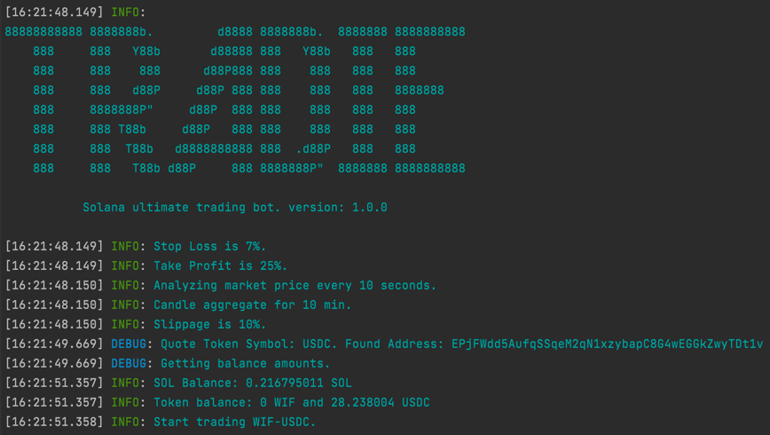

# Tradie - Solana Trading Bot

Tradie is an innovative, open-source trading bot tailored for the Solana blockchain. Leveraging Jupiter for token swapping and CryptoCompare for market analysis, Tradie aims to empower traders with automated, sophisticated trading strategies. Developed with TypeScript, Tradie offers robust, type-safe code, enhancing both performance and maintainability.



## Features

- **Efficient Token Swapping**: Utilizes Jupiter for seamless token exchanges on the Solana blockchain.
- **Detailed Market Analysis**: Leverages candlestick data from CryptoCompare to guide trading decisions.
- **Advanced Technical Indicators**: Incorporates indicators like Relative Strength Index (RSI), short and medium Exponential Moving Averages (EMA), and Bollinger Bands (BB) for market analysis.
- **Customizable Trading Strategies**: Allows detailed configuration of slippage, stop loss, take profit, RSI.
- **Real-Time Data Processing**: Fetches market data at user-defined intervals for timely trading decisions.
- **Transparent Logging**: Provides extensive logging to monitor operations and performance.

## Prerequisites

- Node.js (version 21+ recommended, but should be compatible with older versions) installed on your system. Visit [Node.js](https://nodejs.org/) for installation instructions.
- A Solana wallet private key.
- A CryptoCompare API key for market data access, obtainable [here](https://www.cryptocompare.com/cryptopian/api-keys).
- Solana RPC endpoint, obtainable [here](https://quicknodes.com/).

## Technical Details

- **TypeScript**: Tradie is written in TypeScript, offering enhanced code quality and developer experience. Make sure you're familiar with TypeScript for any contributions or customizations.

## Installation

1. Clone the Tradie repository:
   ```bash
   git clone https://github.com/oboshto/tradie.git
   cd tradie
   ```

2. Install dependencies:
   ```bash
   npm install
   ```

## Configuration

1. Rename `.env.copy` to `.env` and configure your settings.
2. Open the .env file in a text editor and fill in your details:

- `PRIVATE_KEY`: Your Solana wallet private key.
- `CRYPTO_COMPARE_API_KEY`: Your API key from CryptoCompare.
- `RPC_ENDPOINT`: Your Solana RPC endpoint URL.
- `BUY_TOKEN_ADDRESS`: The address of the token you want to buy.
- `QUOTE_SYMBOL`: The symbol of the quote currency (`default: USDC`).
- `CANDLE_AGGREGATE_MINUTES`: Candlestick aggregation period in minutes (`default: 15`).
- `GET_MARKET_DATA_INTERVAL_SECONDS`: Interval for fetching market data in seconds (`default: 30`).
- `SLIPPAGE_PERCENT`: Maximum acceptable slippage percentage (`default: 10`).
- `STOP_LOSS`: Stop loss percentage (`default: 7`).
- `TAKE_PROFIT`: Take profit percentage (`default: 25`).
- `RSI_TO_BUY`: RSI lower value to buy (`default: 30`).
- `RSI_TO_SELL`: RSI upper value to sell (`default: 70`).
- `TRANSACTION_PRIORITY_FEE`: solana transaction priority fee (`default: 'auto'`, or in SOL e.g. `0.005`).
- `LOG_LEVEL`: Logging level (`deafult: info`).

## Usage

Start the bot with `npm start`. Tradie will execute trades based on your settings.

## Future Plans

- **Indicator Customization**: Plans for more customizable indicator values.
- **More Technical Indicators**: Expanding the array of technical analysis tools available.

## Risk Disclaimer

The use of Tradie and any automated trading software inherently involves financial risks, including the potential loss of funds. The developer(s) of Tradie cannot be held responsible for any financial losses incurred while using the bot. Users should trade with caution and only with funds they can afford to lose. This software is provided "as is", with no guarantee of profitability or performance.

## Community

Join our Discord for discussions and support: [Tradie Discord](https://discord.gg/ApF28mbYkf).

## Contributing

Fork the repo, create a feature branch, and submit your pull request for improvements.

## License

Available under the [MIT License](LICENSE), promoting open collaboration.
